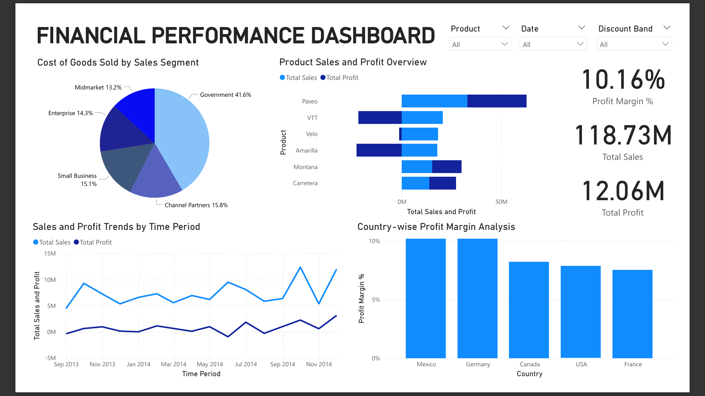

# Financial-Statement-Dashboard

##  Project Overview
This project presents a **Financial Performance Dashboard** that provides insights into a company’s sales, profit, and cost metrics.  
The goal is to visualize key financial indicators using **Power BI**, based on data that was first cleaned and prepared in **Microsoft Excel**.

---

##  Data Preparation
- **Tool Used:** Microsoft Excel  
- **Tasks Performed:**
  - Removed missing or inconsistent data  
  - Standardized column names and formats  
  - Created calculated columns (e.g., Profit, Profit Margin %)  
  - Segmented data by product, country, and customer type  

---

##  Dashboard Development
- **Tool Used:** Power BI  
- **Purpose:** To visualize the cleaned financial data interactively and extract meaningful insights.  
- **Key Visuals Included:**
  - **Cost of Goods Sold by Sales Segment:** Pie chart showing segment-wise distribution.  
  - **Product Sales and Profit Overview:** Bar chart comparing total sales and profit by product.  
  - **Sales and Profit Trends by Time Period:** Line chart tracking performance over time.  
  - **Country-wise Profit Margin Analysis:** Bar chart comparing profit margins across regions.  
  - **KPI Cards:** Displaying Total Sales, Total Profit, and Profit Margin %.  

---

##  File Structure
Financial-Statement-Dashboard/  
│  
├── dashboard/  
│ ├── dashboard.png # Screenshot of the Power BI Dashboard  
│ ├── report.pbix # Power BI Project File  
│ ├── report.pdf # Exported PDF version of the dashboard  
│  
├── data/  
│ ├── Financial Data.xlsx # Raw and cleaned financial dataset  
│  
└── README.md # Project documentation  

---

##  Dashboard Preview
Below is a preview of the Financial Performance Dashboard:



---

##  Key Insights
- The **Government segment** contributes the highest proportion to total sales (~41%).  
- **Paseo** is the top-performing product in both sales and profit.  
- **Germany** shows the highest profit margin among the listed countries.  
- Overall **Profit Margin** stands at **10.16%**, with **Total Sales** of **118.73M** and **Total Profit** of **12.06M**.  

---

##  Tools and Technologies
- **Excel** – Data Cleaning and Preprocessing  
- **Power BI** – Data Visualization and Dashboard Creation  
- **GitHub** – Version Control and Project Sharing  

---

##  How to Use
1. Download the repository or clone it:
   ```bash
   git clone https://github.com/NishuMehta/Financial-Statement-Dashboard.git
